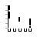
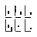

<!-- README.md is generated from README.Rmd. Please edit that file -->

```{r, echo = FALSE}
knitr::opts_chunk$set(
  collapse = TRUE,
  comment = "#>",
  fig.path = "README/",
  cache.path = "README/cache/",
  cache = TRUE,
  autodep=TRUE
)
```

# splot! --- Stefan's plot library of tricks

Just another [ggplot2](http://ggplot2.tidyverse.org) and 
[knitr](https://yihui.name/knitr/) extension package.

This package contains functions primarily in these domains of ggplot2:

```{r domain_axis_lines,include=FALSE,fig.height=0.5,fig.width=0.5}
library(ggplot2)
library(splot)
ggplot(mtcars, aes(x=cyl, y=mpg)) + 
  geom_point(size=0.1) + 
  coord_capped_cart(bottom=brackets_horisontal(), left='both') +
  theme_light() + 
  theme(panel.border=element_blank(), axis.line = element_line(),
        axis.title=element_blank(), axis.text=element_blank(),
        panel.grid=element_blank(), axis.ticks.x = element_line(colour='black'))
```
```{r domain_facets,include=FALSE,fig.height=0.5, fig.width=0.5}
ggplot(mtcars, aes(x=cyl, y=mpg)) + 
  geom_point(size=0.1) + 
  coord_capped_cart(bottom='both', left='both') +
  facet_rep_wrap(~carb) +
  theme_light() + 
  theme(panel.border=element_blank(), axis.line = element_line(),
        axis.title=element_blank(), axis.text=element_blank(),
        panel.grid=element_blank(), axis.ticks = element_blank(), 
        axis.ticks.length = unit(0, 'npc'), panel.spacing=unit(1, 'mm'),
        strip.background=element_blank(), strip.text=element_blank())
```

*  Axis lines
*  Repeated axis lines on facets.
* Legends
* knitr

## Installation

```{r, eval = FALSE}
# install.packages("devtools")

# Install release from GitHub:
devtools::install_github("stefanedwards/splot", ref='v0.1')

# Or get the lastest development version from GitHub:
devtools::install_github("stefanedwards/splot")
```


## Usage

We can display a limit on the axes range.
```{r usage1}
library(splot)
ggplot(mtcars, aes(x=cyl, y=mpg)) + 
  geom_point() + 
  coord_capped_cart(bottom='both', left='none') +
  theme_light() + theme(panel.border=element_blank(), axis.line = element_line())
```

**NB**: Disable `panel.border` and enable `axis.line` in `theme`, otherwise you will not see an effect!

We could also show that the x-axis is categorical (or ordinal):
```{r brackets_demo}
ggplot(mtcars, aes(x=as.factor(cyl), y=mpg)) + 
  geom_point(position=position_jitter(width=0.1)) + 
  coord_flex_cart(bottom=brackets_horisontal(), left=capped_vertical('none')) +
  theme_light() + theme(panel.border=element_blank(), axis.line = element_line())
```


## Legends

Reposition the legend onto the plot. Exactly where you want it:
```{r reposition_legend,fig.cap='The legend repositioned onto the top left corner of the panel.'}
dsamp <- diamonds[sample(nrow(diamonds), 1000), ]
d <- ggplot(dsamp, aes(carat, price)) +
  geom_point(aes(colour = clarity))
reposition_legend(d, 'top left')
```

Scavenging the Internet, we have found some functions that help work with 
legends.

Frequently appearing on [Stack Overflow](http://stackoverflow.com), we bring 
you `g_legend`:
```{r g_legend,fig.height=3,fig.width=2,fig.cap='The legend grob, by itself.'}
library(grid)
legend <- g_legend(d)
grid.newpage()
grid.draw(legend)
```

[Shaun Jackman](http://rpubs.com/sjackman) 
[originally]([http://rpubs.com/sjackman/grid_arrange_shared_legend)
brought us the
`grid_arrange_shared_legend`, which was furhter refined by `baptiste` 
([original](https://github.com/tidyverse/ggplot2/wiki/Share-a-legend-between-two-ggplot2-graphs)).
We put it in a package.

```{r grid_arrange_shared_legend,fig.cap='Four plots that share the same legend.'}
dsamp <- diamonds[sample(nrow(diamonds), 1000), ]
p1 <- qplot(carat, price, data = dsamp, colour = clarity)
p2 <- qplot(cut, price, data = dsamp, colour = clarity)
p3 <- qplot(color, price, data = dsamp, colour = clarity)
p4 <- qplot(depth, price, data = dsamp, colour = clarity)
grid_arrange_shared_legend(p1, p2, p3, p4, ncol = 2, nrow = 2)
```


## Extensions to knitr

We automatically load knitr's `knit_print` for 
data frames and dplyr tables to provide automatic pretty printing of
these using `kable`:

Before loading `splot` package:
```{r knit_print_disable,include=FALSE}
options(knit_print=FALSE)
```
```{r}
data(USArrests)
head(USArrests)
```

After loading `splot`:
```{r knit_print_enable,include=FALSE}
options(knit_print=TRUE)
```
```{r}
head(USArrests)
```

See `knit_print.data.frame`.


## To do:

* Describe coord objects in capped-axes vignette.
