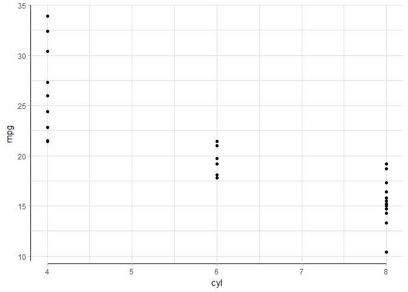
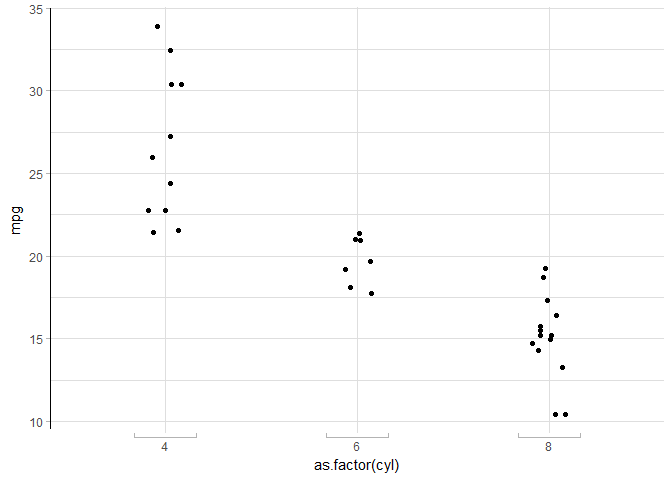

<!-- README.md is generated from README.Rmd. Please edit that file -->
splot - Stefan's plotting package
=================================

Just another [ggplot2](http://ggplot2.tidyverse.org) extension.

Installation
------------

``` r
# Or the the development version from GitHub:
# install.packages("devtools")
devtools::install_github("stefanedwards/splot")
```

Usage
-----

We can display a limit on the axes range.

``` r
library(splot)
#> Loading required package: ggplot2
#> Loading required package: grid
#> Loading required package: gridExtra
#> Loading required package: gtable
ggplot(mtcars, aes(x=cyl, y=mpg)) + 
  geom_point() + 
  coord_capped_cart(bottom='both', left='none') +
  theme_light() + theme(panel.border=element_blank(), axis.line = element_line())
```



**NB**: Disable `panel.border` and enable `axis.line` in `theme`, otherwise you will not see an effect!

We could also show that the x-axis is categorical (or ordinal):

``` r
ggplot(mtcars, aes(x=as.factor(cyl), y=mpg)) + 
  geom_point(position=position_jitter(width=0.1)) + 
  coord_flex_cart(bottom=brackets_horisontal(), left=capped_vertical('none')) +
  theme_light() + theme(panel.border=element_blank(), axis.line = element_line())
```



Extensions to knitr
-------------------

We automatically load knitr's k`nit_print` for data frames and dplyr tables to provide automatic pretty printing of these using `kable`:

Before loading `splot` package:

``` r
data(USArrests)
head(USArrests)
#>            Murder Assault UrbanPop Rape
#> Alabama      13.2     236       58 21.2
#> Alaska       10.0     263       48 44.5
#> Arizona       8.1     294       80 31.0
#> Arkansas      8.8     190       50 19.5
#> California    9.0     276       91 40.6
#> Colorado      7.9     204       78 38.7
```

After loading `splot`:

``` r
head(USArrests)
```

|            |  Murder|  Assault|  UrbanPop|  Rape|
|------------|-------:|--------:|---------:|-----:|
| Alabama    |    13.2|      236|        58|  21.2|
| Alaska     |    10.0|      263|        48|  44.5|
| Arizona    |     8.1|      294|        80|  31.0|
| Arkansas   |     8.8|      190|        50|  19.5|
| California |     9.0|      276|        91|  40.6|
| Colorado   |     7.9|      204|        78|  38.7|

See `knit_print.data.frame`.
