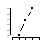
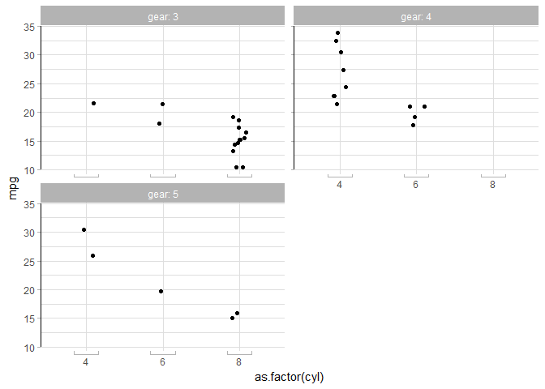
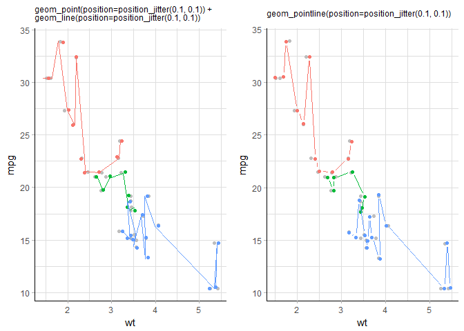

<!-- README.md is generated from README.Rmd. Please edit that file -->
Lemon --- Freshing up your ggplots
==================================

[](https://cran.r-project.org/package=lemon) 

Just another [ggplot2](http://ggplot2.tidyverse.org) and [knitr](https://yihui.name/knitr/) extension package.

This package contains functions primarily in these domains of ggplot2:

-    Axis lines.
-    Repeated axis lines on facets.
-    `geom_pointpath` and `geom_pointline`.
-   Legends

As well as some functions in knitr.

Installation
------------

``` r
# install.packages("devtools")

# Install release from GitHub:
devtools::install_github("stefanedwards/lemon", ref='v0.3.1')

# Or get the lastest development version from GitHub:
devtools::install_github("stefanedwards/lemon")
```

Axis lines
----------

We can display a limit on the axes range.

``` r
library(lemon)
ggplot(mtcars, aes(x=cyl, y=mpg)) + 
  geom_point() + 
  coord_capped_cart(bottom='both', left='none') +
  theme_light() + theme(panel.border=element_blank(), axis.line = element_line())
```


**NB**: Disable `panel.border` and enable `axis.line` in `theme`, otherwise you will not see an effect!

We could also show that the x-axis is categorical (or ordinal):

``` r
(p <- ggplot(mtcars, aes(x=as.factor(cyl), y=mpg)) + 
  geom_point(position=position_jitter(width=0.1)) + 
  coord_flex_cart(bottom=brackets_horisontal(), left=capped_vertical('both')) +
  theme_light() + theme(panel.border=element_blank(), axis.line = element_line())
)
```


When capping the axis lines, they are never capped further inwards than the ticks! Look up

-   `coord_capped_cart`, `coord_capped_flip`
-   `coord_flex_cart`, `coord_flex_flip`, `coord_flex_fixed`
-   `brackets_horisontal`, `brackets_vertical`
-   `capped_horisontal`, `capped_vertical`

Facets
------

Having produced such wonderous axes, it is a pity they are not plotted around all panels when using faceting. We have extended both `facet_grid` and `facet_wrap` to produce axis, ticks, and labels on *all* panels:

``` r
p + facet_rep_wrap(~gear, ncol=2, label=label_both)
```



They work just like the normal ones; look up `facet_rep_grid` and `facet_rep_wrap`.

`geom_pointline`
----------------

A geom that combines both points and lines. While possible by using both `geom_point` and `geom_line`, position adjustments are not preserved between the two layers. `geom_pointline` and `geom_pointpath` combines `geom_point` with `geom_line` and `geom_path`, respectively, while preserving position adjustments.

 Left: `geom_point` and `geom_line` as two separate geoms. Right: The two geoms combined into `geom_pointline`. Both produced with `ggplot(mtcars, aes(wt, mpg, colour=factor(cyl))) + geom_point(col='grey')`, where the grey points indicate the true location of the datapoint.

An added visual effect is seen as the lines do not touch the points, leaving a small gap (set by argument `distance`).

Legends
-------

Reposition the legend onto the plot. Exactly where you want it:

``` r
dsamp <- diamonds[sample(nrow(diamonds), 1000), ]
d <- ggplot(dsamp, aes(carat, price)) +
  geom_point(aes(colour = clarity))
reposition_legend(d, 'top left')
```

 The legend repositioned onto the top left corner of the panel.

Scavenging the Internet, we have found some functions that help work with legends.

Frequently appearing on [Stack Overflow](https://stackoverflow.com), we bring you `g_legend`:

``` r
library(grid)
legend <- g_legend(d)
grid.newpage()
grid.draw(legend)
```

 The legend grob, by itself.

Originally brought to you by [Baptiste Auguié](http://baptiste.github.io/) (<https://github.com/tidyverse/ggplot2/wiki/Share-a-legend-between-two-ggplot2-graphs>) and [Shaun Jackman](http://rpubs.com/sjackman) (<http://rpubs.com/sjackman/grid_arrange_shared_legend>). We put it in a package.

``` r
dsamp <- diamonds[sample(nrow(diamonds), 1000), ]
p1 <- qplot(carat, price, data = dsamp, colour = clarity)
p2 <- qplot(cut, price, data = dsamp, colour = clarity)
p3 <- qplot(color, price, data = dsamp, colour = clarity)
p4 <- qplot(depth, price, data = dsamp, colour = clarity)
grid_arrange_shared_legend(p1, p2, p3, p4, ncol = 2, nrow = 2)
```

 Four plots that share the same legend.

Extensions to knitr
-------------------

`knitr` allows S3 methods for `knit_print` for specialised printing of objects. We provide `lemon_print` for data frames, dplyr tables, and summary objects, that can be used to render the output, without mucking up the code source. An added benefit is that we can use RStudio's inline data frame viewer:


### Relative file paths made safe

Using `knitr` for computations that use external binaries and/or write temporary files, setting the root directory for `knitr`'s knitting saves the user from a file mess. E.g.

``` r
knitr::opts_knit$set(root.dir=TMPDIR)
```

But we want to keep our file paths relative for the scripts / document to be transferable. We introduce the `.dot` functions:

``` r
TMPDIR=tempdir()

.data <- .dot('data')

knitr_opts_knit$set(root.dir=TMPDIR)
```

We can then load our data file using the created `.data` function, even though the chunk is executed from TMPDIR.

``` r
dat <- read.table(.data('mydata.tab'))
```
