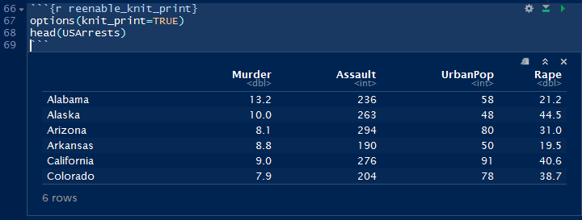
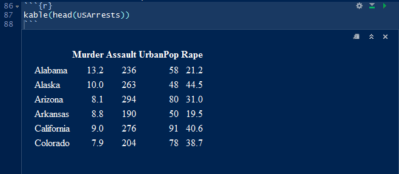

This vignette demonstrates how load the `splot` package automatically
enables pretty printing of data frames with knitr's `kable`.

The beauty of defining the function `knit_print.data.frame` is that when
working with R Notebooks in R, the editor can output the data frame dynamically,
while ensuring that the knitted document also has the 


```{r setup,include=FALSE}
library(knitr)

knitr::opts_chunk$set(fig.height=4, fig.width=6, verbatim=FALSE)

# Show chunk verbatim
# Source: http://stackoverflow.com/questions/19908158/show-an-r-markdown-chunk-in-the-final-output
# Set verbatim option as last and it will not be printed. ;)
hook_source_def = knit_hooks$get('source')
knit_hooks$set(source = function(x, options){
  if (!is.null(options$verbatim) && options$verbatim){
    opts = gsub(",\\s*verbatim\\s*=\\s*TRUE\\s*", "", options$params.src)
    bef = sprintf('\n\n    ```{r %s}\n', opts, "\n")
    stringr::str_c(bef, paste(knitr:::indent_block(x, "    "), collapse = '\n'), "\n    ```\n")
  } else {
     hook_source_def(x, options)
  }
})

```

First we load some data and show the top.
```{r}
data(USArrests)
head(USArrests)
```

Now load `splot`.

```{r}
library(splot)
```

**The same view is now nicely printed!**
```{r kable.opts=list(caption="Data frame is now printed using `kable`."),verbatim=TRUE}
head(USArrests)
```

Notice how we specified `kable` options using the chunk option `kable.opts`.

**Disabling the functions.**

```{r disable_knit_print}
options(knit_print=FALSE)
head(USArrests)
```

You can still ask for `kable`.

```{r}
kable(head(USArrests))
```

**`knit_print` re-enabled.**

```{r reenable_knit_print}
options(knit_print=TRUE)
head(USArrests)
```

The above code block, when edited in RStudio, would look like this:


We can still use `kable`,
```{r}
kable(head(USArrests))
```

But in RStudio, it would look like this:
