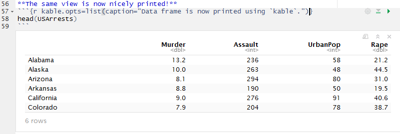
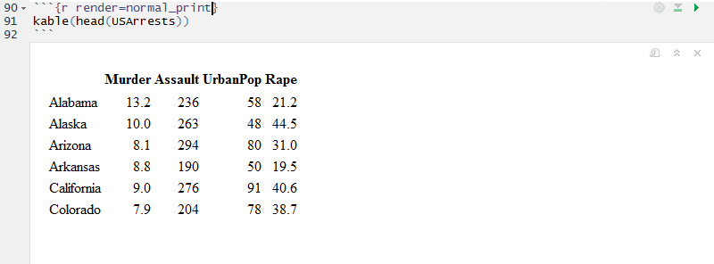

This vignette demonstrates how load the `splot` package automatically
enables pretty printing of data frames with knitr's `kable`.

The beauty of defining the function `knit_print.data.frame` is that when
working with R Notebooks in R, the editor can output the data frame dynamically,
while ensuring that the knitted document also has the 


```{r setup,include=FALSE}
library(knitr)

knitr::opts_chunk$set(fig.height=4, fig.width=6, verbatim=FALSE,
                      cache=TRUE, autodep = TRUE, cache.path='lemon_print-cache/')

# Show chunk verbatim
# Source: http://stackoverflow.com/questions/19908158/show-an-r-markdown-chunk-in-the-final-output
# Set verbatim option as last and it will not be printed. ;)
hook_source_def = knit_hooks$get('source')
knit_hooks$set(source = function(x, options){
  if (!is.null(options$verbatim) && options$verbatim){
    opts = gsub(",\\s*verbatim\\s*=\\s*TRUE\\s*", "", options$params.src)
    bef = sprintf('\n\n    ```{r %s}\n', opts, "\n")
    stringr::str_c(bef, paste(knitr:::indent_block(x, "    "), collapse = '\n'), "\n    ```\n\n")
  } else {
     hook_source_def(x, options)
  }
})

```

First we load some data and show the top.
```{r}
data(USArrests)
head(USArrests)
```

```{r render=lemon_print}
head(USArrests)
```

Now load `lemon` and set the `lemon_print` functions.

```{r}
library(lemon)
knit_print.data.frame <- lemon_print
```

**The same view is now nicely printed!**
```{r caption="Data frame is now printed using `kable`.",verbatim=TRUE}
head(USArrests)
```

Notice how we specified `kable` arguments directly as chunk-options.

## How it works

knitr uses a S3 generic function, `knit_print`, to print objects. 
[Method dispatching in R ](http://adv-r.had.co.nz/S3.html) means that by 
defining a function, say `knit_print.data.frame`, calling `knit_print(df)` will
call our function *if* `df` was a data frame.

To have knitr use our function when outputting a data frame, we define the 
function `knit_print.data.frame` (and similar for data frames passed through
dplyr functions, i.e `tbl_df` and `grouped_df`).

Disabling the function is by usual chunk options, `render = normal_print`.
check `?knit_print`.

**Disabling the functions.**

```{r normal_print,render=normal_print,verbatim=TRUE}
head(USArrests)
```

You can still ask for `kable`.

```{r results='asis',render=normal_print,verbatim=TRUE}
kable(head(USArrests),caption='Normal `kable` usage.')
```


### It uses kable

We have mentioned `kable` a couple of times.
That is because the `lemon_print` for data frames uses 
`kable` of the knitr package.

**Some common arguments:**

* `caption`: Table caption. See examples in demonstration.
* `align`: Vector of column alignments with `'l'`, `'c'`, and `'r'`.
Or, a single element, i.e. `c('c','l','r') = 'clr')`.
* `row.names`: A logical value indicating whether to include row names.
* `col.names`: A character vector of column names to be used in the table.

## Why does it matter

The second code block, when edited in RStudio, would look like this:

And, as demonstrated, the rendered document has the data frame printed nicely.

If we do not wish this behaviour, but still use `kable`,
```{r}
kable(head(USArrests))
```

RStudio would look like this:


## Other objects covered

Summaries are nicely formatted, but these require setting the S3 method for 
`table`.

```{r kable.opts=list(caption='Summary tables are printed with some default options.'),verbatim=TRUE}
knit_print.table <- lemon_print
summary(USArrests)
```

Cross-tabulations are however not nicely formatted.

```{r mtcars}
head(mtcars)
with(mtcars, table(cyl, gear))
```


### dplyr

```{r dplyr,kable.opts=list(caption='Also works on `dplyr` objects.'),verbatim=TRUE}
library(dplyr)
mtcars %>% group_by(cyl) %>% summarise(mean(disp))
```
